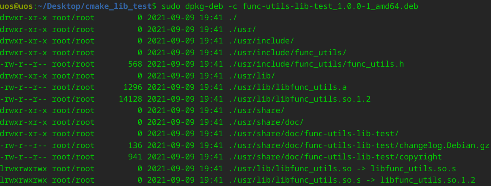
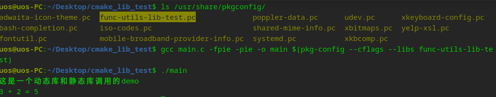

# 说明

This is a demo for dynamic library and static library. 这是一个使用CMake构建动态库和静态库的测试，也演示了pkgconfig文件的配置。

# 使用方式

先将func-utils-lib打成deb包安装后，再将func-utils-lib-test.pc（也可以将此文件放到func-utils-lib包中）拷贝到/usr/share/pkgconfig/目录后执行

```
gcc main.c -fpie -pie -o main $(pkg-config --cflags --libs func-utils-lib-test)
```



# 运行



# 参考文档

* [pkg-config的简单用法](https://blog.csdn.net/feng__shuai/article/details/126916291)

* https://github.com/Liuyvjin/notebook/tree/master/Cmake
